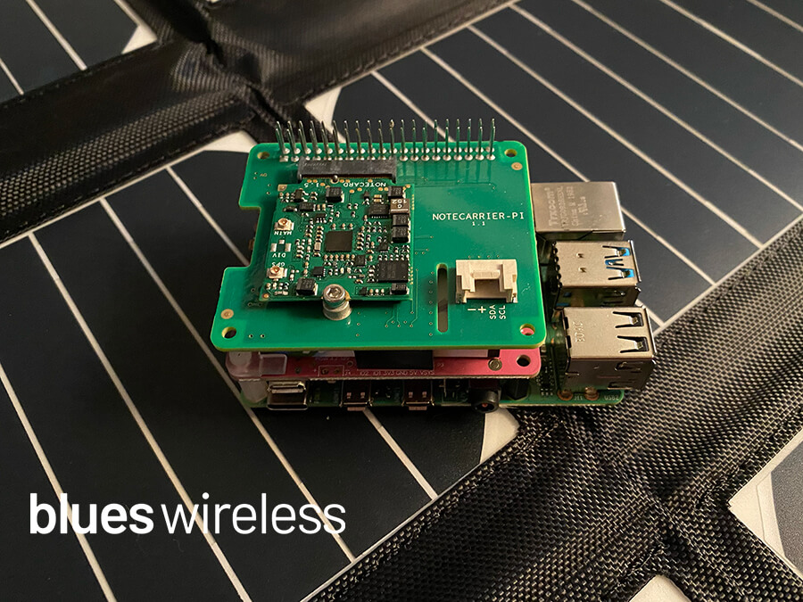

# Solar-Powered Crypto Mining with Raspberry Pi

Mine some cryptocurrency using the sun and your Raspberry Pi!

> View the complete tutorial over at
> [Hackster.io](https://www.hackster.io/rob-lauer/solar-powered-crypto-mining-with-raspberry-pi-64adee)

**Hardware:**

- [Raspberry Pi 4](https://www.raspberrypi.org/products/raspberry-pi-4-model-b/)
- [Notecard and Notecarrier-Pi HAT](https://blues.io/products/) from Blues
  Wireless
- [PiJuice](https://uk.pi-supply.com/products/pijuice-standard)
- [42W Solar Array](https://smile.amazon.com/gp/product/B08DCF1VPL/ref=ppx_yo_dt_b_asin_title_o02_s00?ie=UTF8&psc=1)

**Software and Services:**

- [Python](https://www.python.org/)
- [Blues Wireless Notehub](https://blues.io/services/)
- [Ubidots](https://ubidots.com/)
